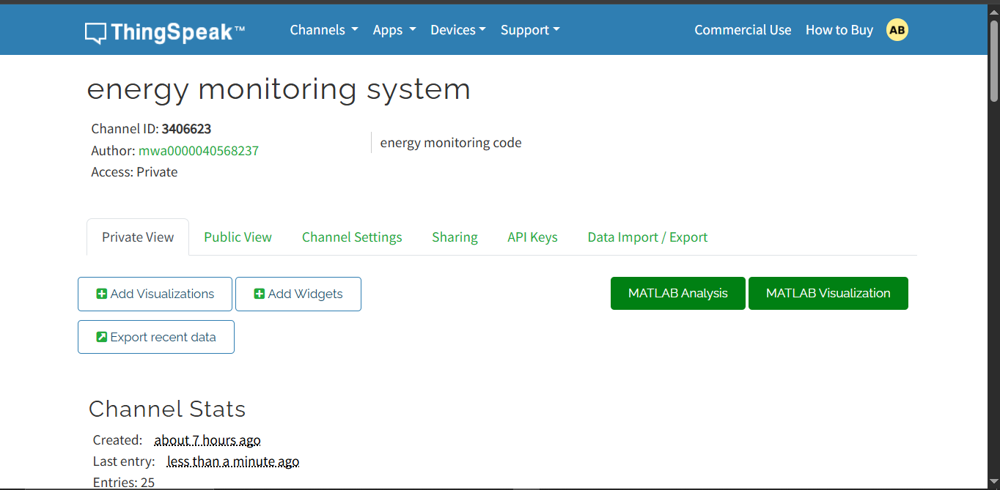
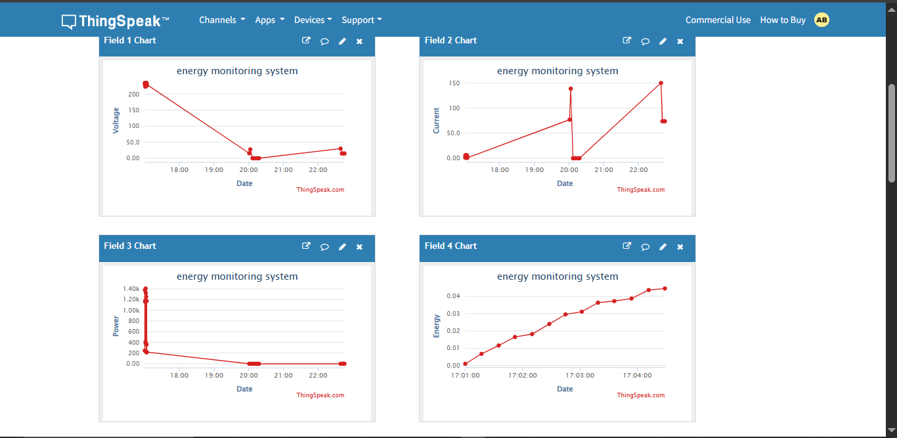
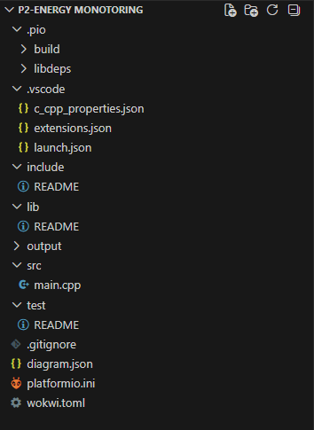
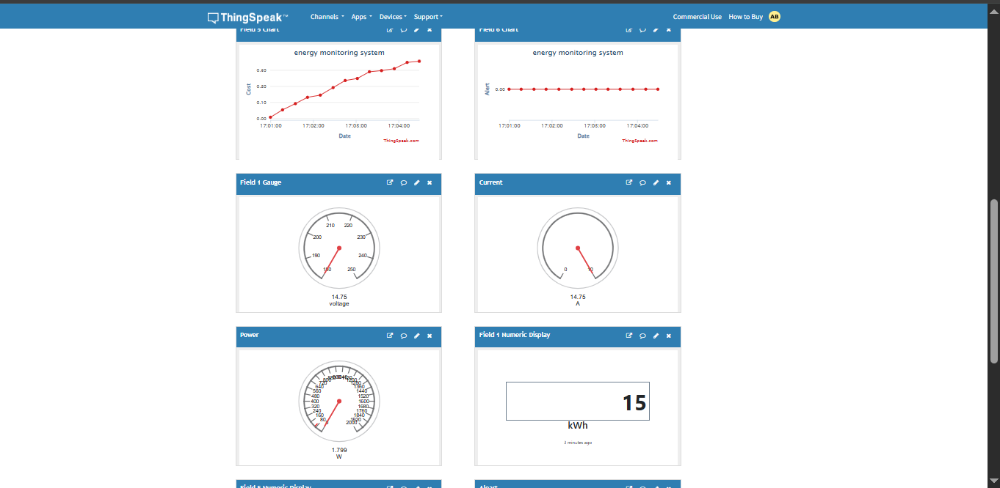
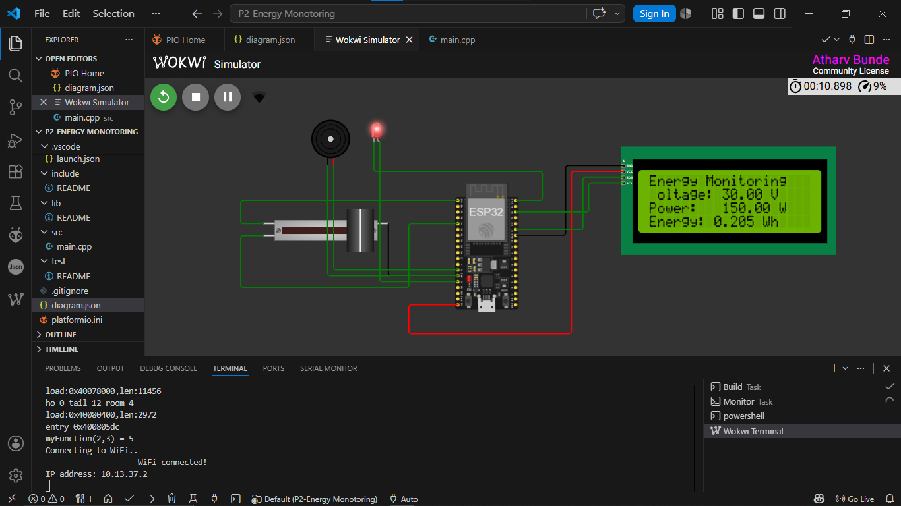
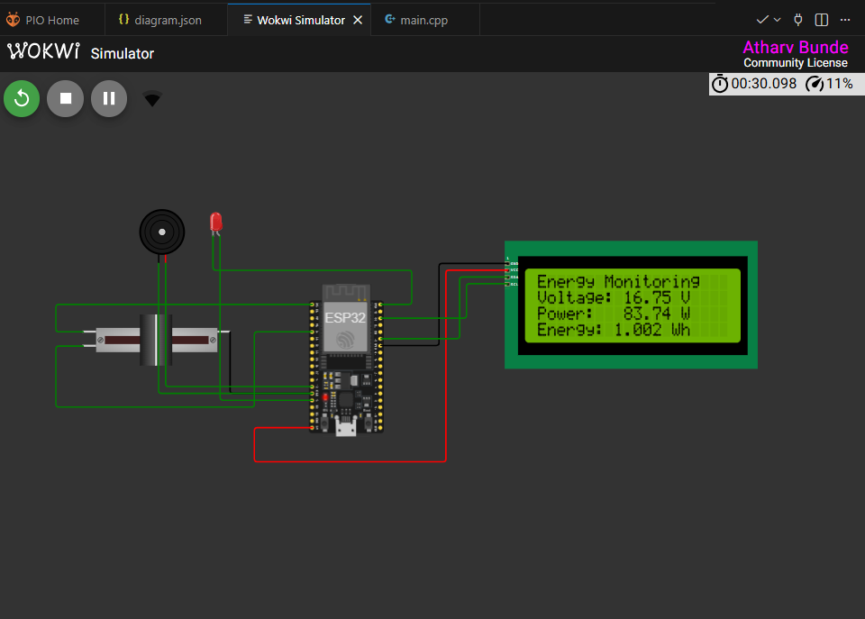

# ⚡ Smart Home Energy Monitoring System

## 📌 Overview

The **Smart Home Energy Monitoring System** is an IoT-based project developed using **ESP32, Wokwi Simulation, and ThingSpeak Cloud**. The system continuously monitors electrical parameters such as voltage, current, power consumption, total energy usage, electricity cost, and overload conditions.

This project demonstrates real-time energy monitoring, cloud connectivity, data visualization, and alert generation without requiring physical hardware, making it ideal for students, researchers, and IoT enthusiasts.

---

# 🚀 Why This Project Is Important to Industry

Energy monitoring systems are widely used across industries to optimize electricity usage, reduce operational costs, and improve energy efficiency.

## Industry Applications

### 🏠 Smart Homes

* Monitor household electricity consumption.
* Identify energy-hungry appliances.
* Reduce monthly electricity bills.
* Detect abnormal energy usage.

### 🏢 Commercial Buildings

* Track floor-wise or department-wise energy consumption.
* Optimize HVAC and lighting systems.
* Improve energy efficiency ratings.

### 🏭 Manufacturing Industries

* Monitor machinery power consumption.
* Detect overloaded equipment.
* Prevent downtime due to electrical faults.
* Improve predictive maintenance.

### ⚡ Energy Management Companies

* Perform energy audits.
* Generate consumption reports.
* Analyze long-term usage trends.

### ☀️ Renewable Energy & Solar Plants

* Track generation and consumption.
* Monitor inverter performance.
* Optimize energy distribution.

---

# 🎯 Key Features

✅ Real-Time Voltage Monitoring

✅ Real-Time Current Monitoring

✅ Power Consumption Calculation

✅ Energy Consumption Tracking

✅ Electricity Cost Estimation

✅ Overload Detection

✅ LED & Buzzer Alerts

✅ Cloud Dashboard Visualization

✅ ThingSpeak Integration

✅ Wokwi Simulation Support

✅ Industry-Oriented Architecture

---

# 🏗️ System Architecture

```text
Slide Potentiometer
        │
        ▼
      ESP32
        │
        ▼
 Power Calculation
        │
        ▼
 Energy Calculation
        │
        ▼
 Cost Estimation
        │
        ▼
 Alert Detection
        │
        ▼
 ThingSpeak Cloud
        │
        ▼
 Dashboard & Reports
```

---

# ⚙️ How the Simulation Works (Workflow)

The slide potentiometer acts as your sensor input, feeding data into the ESP32.

The ESP32 acts as the system's brain—it calculates power usage, accumulates total energy consumption over time, keeps a running cost estimate, and checks for dangerous overloads.

Finally, it outputs these metrics to both the local LCD display and the ThingSpeak cloud dashboard.

---

# 🔌 Component Description

## ESP32 Microcontroller

The central processor that:

* Reads analog sensor data
* Calculates power consumption
* Calculates total energy usage
* Estimates electricity cost
* Connects to Wi-Fi
* Sends data to ThingSpeak
* Triggers overload alerts

---

## Slide Potentiometer

Acts as a virtual current sensor.

Moving the slider simulates turning appliances ON and OFF by changing the current value between:

```text
0A → 30A
```

---

## I2C LCD Display (20x4)

Displays:

* Voltage
* Current
* Power
* Energy
* Cost
* Alert Status

---

## Piezo Buzzer

Produces an audible warning when overload conditions occur.

---

## Red LED

Provides a visual overload warning.

---

# 📊 Energy Calculations

## Power Calculation

```text
Power (W) = Voltage × Current
```

Example:

```text
Voltage = 230V
Current = 5A

Power = 230 × 5
Power = 1150W
```

---

## Energy Calculation

```text
Energy (kWh) = Power(kW) × Time(Hours)
```

Example:

```text
1kW Appliance × 5 Hours

Energy = 5kWh
```

---

## Cost Calculation

```text
Cost = Energy × Tariff
```

Example:

```text
Energy = 5kWh
Tariff = ₹8/kWh

Cost = ₹40
```

---

# 🚨 Alert Logic

If current exceeds the predefined threshold:

```text
LED = ON
Buzzer = ON
Alert = ACTIVE
```

Otherwise:

```text
LED = OFF
Buzzer = OFF
Alert = NORMAL
```

---

# 📁 Project Folder Structure

```text
P2-Energy-Monitoring
│
├── .pio
├── .vscode
├── include
├── lib
├── output
│
├── src
│   └── main.cpp
│
├── test
│
├── diagram.json
├── platformio.ini
├── wokwi.toml
└── README.md
```

---

# 🖼️ Screenshots

## 1. ThingSpeak Dashboard

```markdown

```

Shows:

* Voltage Chart
* Current Chart
* Power Chart
* Energy Chart

---

## 2. ThingSpeak Channel



```

Shows:

* Channel Information
* Widgets
* API Integration

---

## 3. Project File Structure

```markdown

```

Shows complete PlatformIO project organization.

---

## 4. Indicators Dashboard

```markdown

```

Shows:

* Gauges
* Numeric Displays
* Alert Widgets

---

## 5. Load Condition

```markdown

```

Shows different simulated load conditions.

---

## 6. Wokwi Simulation

```markdown

```

Shows complete virtual hardware implementation.

---

# ☁️ ThingSpeak Setup Guide

## Step 1: Create Account

Create a free account on ThingSpeak.

---

## Step 2: Create New Channel

Create the following fields:

```text
Field 1 → Voltage
Field 2 → Current
Field 3 → Power
Field 4 → Energy
Field 5 → Cost
Field 6 → Alert
```

---

## Step 3: Get API Keys

Copy:

```text
Channel ID
Write API Key
Read API Key
```

---

## Step 4: Update ESP32 Code

Replace:

```cpp
CHANNEL_ID
WRITE_API_KEY
```

with your credentials.

---

## Step 5: Add Widgets

Add:

### Charts

* Voltage Chart
* Current Chart
* Power Chart
* Energy Chart

### Gauges

* Voltage Gauge
* Current Gauge
* Power Gauge

### Numeric Displays

* Energy Counter
* Cost Counter

### Indicators

* Alert Status

---

# ▶️ How to Run the Project

## Prerequisites

Install:

### 1. Visual Studio Code

[https://code.visualstudio.com](https://code.visualstudio.com)

### 2. PlatformIO Extension

Install from VS Code Extensions.

### 3. Wokwi Extension

Install from VS Code Extensions.

---

## Running the Simulation

### Step 1

Open project folder:

```text
P2-Energy-Monitoring
```

---

### Step 2

Verify files exist:

```text
src/main.cpp
diagram.json
wokwi.toml
platformio.ini
```

---

### Step 3

Start Wokwi

```text
Wokwi → Start Simulation
```

---

### Step 4

Move the slide potentiometer.

This simulates:

```text
Low Load
Medium Load
High Load
Overload
```

---

### Step 5

Observe Outputs

#### LCD

```text
Voltage
Current
Power
Energy
Cost
```

#### Serial Monitor

```text
Voltage
Current
Power
Energy
Alert
```

#### ThingSpeak

```text
Live Charts
Live Gauges
Historical Data
```

---

# 📈 Expected Outputs

### Normal Condition

```text
Current < Threshold

LED OFF
Buzzer OFF
Alert NORMAL
```

---

### High Load Condition

```text
Current Near Threshold

LED OFF
Buzzer OFF
Alert WARNING
```

---

### Overload Condition

```text
Current > Threshold

LED ON
Buzzer ON
Alert ACTIVE
```

---

# 🎓 Learning Outcomes

This project demonstrates:

* Embedded Systems
* ESP32 Programming
* IoT Communication
* Cloud Dashboards
* Data Logging
* Energy Analytics
* Industrial Monitoring Systems
* Industry 4.0 Concepts

---

# 💼 Resume / LinkedIn Value

This project showcases skills in:

* Internet of Things (IoT)
* Embedded Systems
* ESP32 Development
* Cloud Computing
* Data Visualization
* Energy Monitoring
* Industry 4.0
* Real-Time Analytics

Suitable roles:

* IoT Developer
* Embedded Engineer
* Automation Engineer
* Energy Analyst
* Smart Building Engineer
* Industrial IoT Engineer

---

# 🔮 Future Enhancements

* MQTT Integration
* Node-RED Dashboard
* Grafana Analytics
* Mobile Application
* AI Energy Forecasting
* Smart Appliance Control
* Solar Energy Monitoring
* Home Assistant Integration

---

# 👨‍💻 Author

**Atharv Bunde**

**IoT | ESP32 | Embedded Systems | Industry 4.0 | Cloud Dashboards**
